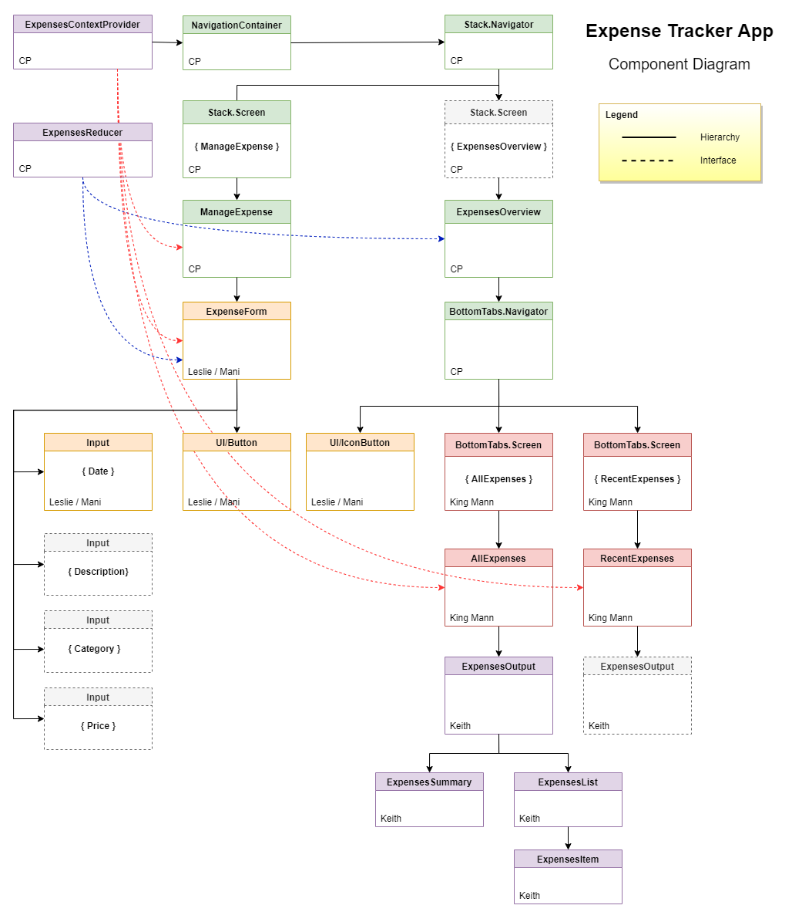

# Group 1 Project: Module 4 - Expense Tracker App

This repository is for Group1-SkillsUnion Module4 Project-ExpenseTrackerApp. 
Tech Stack used: React-Native | Node.js

[Live link of component diagram](https://drive.google.com/file/d/18gFM3l5t8SxogWHo97P6_805FVpia1CI/view?usp=sharing)

## Documentation

`useReducer` (https://beta.reactjs.org/apis/usereducer)

`useContext` (https://beta.reactjs.org/apis/usecontext)

`createContext` (https://beta.reactjs.org/apis/createcontext)

